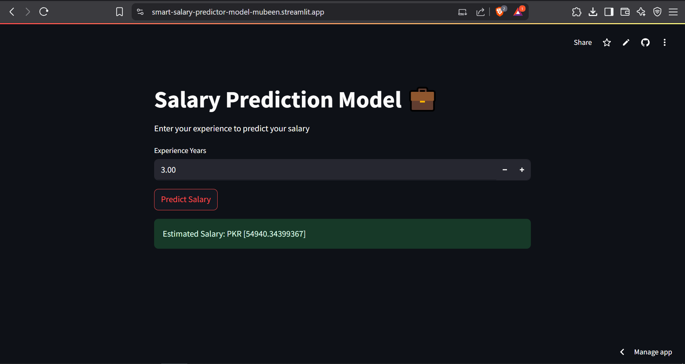

# 💼 Salary Prediction Model

This project demonstrates a simple **Linear Regression** model built with **scikit-learn** to predict a person's salary based on their years of experience. The model is deployed using **Streamlit** for a clean and interactive web interface.

<br>

## 🌐 Live Demo
🔗 [Visit Website](https://smart-salary-predictor-model-mubeen.streamlit.app/ 
)

<br>

## 📸 Screenshot



<br>

## 📊 Dataset

- Source: [Salary Dataset](https://github.com/Mubeen-Channa/smart-salary-predictor-model/blob/28a3307bf1be99e30dbea52fbf7f7798bab9ef92/salary.csv)
- Contains:
  - `Experience Years`
  - `Salary`

<br>

## 🔧 Technologies Used

- Python  
- Pandas & Matplotlib  
- Scikit-learn  
- Streamlit  
- Pickle (for model serialization)

<br>

## 🧠 Model Workflow

1. **Load Dataset** (online & offline options)
2. **Visualize** the relationship using a scatter plot
3. **Split** data into training and testing sets
4. **Train** a Linear Regression model
5. **Evaluate** model with R² Score and MSE
6. **Serialize** the trained model using `pickle`
7. **Deploy** using `Streamlit`

<br>

## 🙏 Contributors

Thanks to everyone who’s contributed!

- **Mubeen Channa** ([@Mubeen-Channa](https://github.com/Mubeen-Channa)) – Project Maintainer  
- **Irfan Narejo** ([@meet-irfan](https://github.com/meet-irfan)) – Boosted accuracy to 90% (+4%) and reduced MSE from 48 to 31  
- **Muhammad Younis** ([@YounisJ](https://github.com/YounisJ)) – Updated salary dataset with new experience and compensation entries  

Feel free to add yourself here if you make a contribution!

<br>

<table>
  <tr>
    <td align="center" width="33%">
      <a href="https://github.com/Mubeen-Channa">
        <br />
        <sub><b>Mubeen Channa</b></sub>
      </a><br />
      <i>Project Lead & Maintainer — Designed, built, and deployed the model</i>
    </td>
    <td align="center" width="33%">
      <a href="https://github.com/meet-irfan">
        <br />
        <sub><b>Irfan Narejo</b></sub>
      </a><br />
      <i>Boosted accuracy to 90% (+4%) and reduced MSE from 48 to 31</i>
    </td>
    <td align="center" width="33%">
      <a href="https://github.com/YounisJ">
        <br />
        <sub><b>Muhammad Younis</b></sub>
      </a><br />
      <i>Updated salary dataset with new experience and compensation entries</i>
    </td>
  </tr>
</table>

<br>

## 🚀 How to Run Locally

1. Clone the repository  
2. Install required packages:  
   ```bash
   1. pip install pandas matplotlib scikit-learn streamlit
   2. python -m streamlit run app.py / streamlit run app.py

